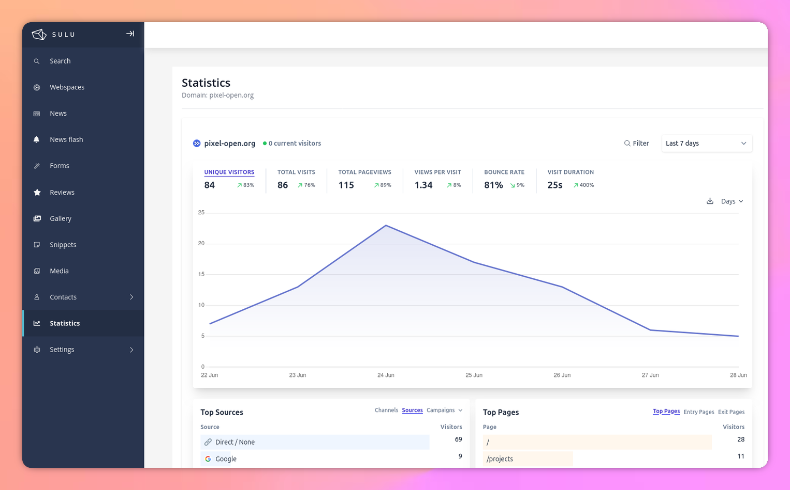

<h1 align="center">
Plausible Bundle for Sulu
</h1>
<div align="center">
This bundle allows you to integrate Plausible analytics statistics into the Sulu administration interface via an embedded iframe.

[](https://php.net/)
[](https://symfony.com)
[](https://github.com/Pixel-Open/sulu-plausiblebundle/releases)
[](https://sonarcloud.io/summary/new_code?id=Pixel-Open_sulu-plausiblebundle)

</div>



## ❤️Features

- ✅ Display Plausible statistics in Sulu admin
- ✅ Configuration via environment variables
- ✅ Support for custom Plausible instances
- ✅ Interface integrated with Sulu design
- ✅ Responsive and optimized for administration
- ✅ Multilingual support (English/French)
- ✅ Translation system using Sulu standards

## 🚀 Installation

1. Install the bundle with composer
```bash
composer require pixelopen/sulu-plausiblebundle
```
2. Create the file plausible.yaml in the config/packages folder
```yaml
plausible:
  domain: '%env(PLAUSIBLE_DOMAIN)%'
  base_url: '%env(default:plausible_default_url:PLAUSIBLE_BASE_URL)%'
  auth_key: '%env(PLAUSIBLE_AUTH_KEY)%'

parameters:
  plausible_default_url: 'https://plausible.io'
```
3. Configure the environment variables in your `.env` file:

```bash
# Plausible Configuration
PLAUSIBLE_DOMAIN=your-domain.com
PLAUSIBLE_BASE_URL=https://plausible.io
PLAUSIBLE_AUTH_KEY=your-auth-key
```
4. Add the plausible.js file to the assets/admin folder located in the [vendor/pixelopen/sulu-plausiblebundle/src/Resources/js/plausible.js]() folder.
5. Add plausible script on app.js to the asset/admin folder :
```js
import './plausible';
```
6. Install all npm dependencies and build the admin UI ([see all options](https://docs.sulu.io/en/2.5/cookbook/build-admin-frontend.html)):
```bash
cd assets/admin
npm install
npm run build
```

## ⚙️ Configuration

### Environment Variables

- `PLAUSIBLE_DOMAIN`: The domain configured in Plausible (required)
- `PLAUSIBLE_BASE_URL`: The base URL of your Plausible instance (default: https://plausible.io)
- `PLAUSIBLE_AUTH_KEY`: Authentication key for shared links (optional but recommended)

### Advanced Configuration

You can customize the configuration in `config/packages/plausible.yaml`:

```yaml
plausible:
    domain: 'my-site.com'
    base_url: 'https://analytics.my-domain.com'
    auth_key: '%env(PLAUSIBLE_AUTH_KEY)%'
```

## 📖 Usage

1. Log in to the Sulu administration
2. Add permission from User roles
3. Click on "Statistics" in the navigation menu
4. Statistics are displayed in an integrated iframe


## ✅ Requirements

- Sulu CMS ^2.6
- PHP ^8.2
- A Plausible account with a configured domain
- Public sharing enabled in Plausible for your site

## 🏳️ Translations

The bundle includes full translation support:

### Supported Languages
- **English** (`admin.en.json`)
- **French** (`admin.fr.json`)

### Translation Keys
- `plausible.statistics` - Main navigation title
- `plausible.configuration_missing` - Error message for missing config
- `plausible.domain_not_configured` - Domain configuration error
- `plausible.check_env_variable` - Environment variable check message
- `plausible.domain` - Domain label
- `plausible.statistics_for` - Iframe title with domain interpolation

### Adding New Languages
To add support for additional languages, create new translation files:
```
src/Resources/translations/admin.{locale}.json
```

## 📝 Notes

- Ensure that public sharing is enabled in your Plausible settings
- The iframe uses the parameters: `embed=true&theme=light&background=transparent`
- The bundle automatically integrates into the administration navigation
- All user-facing text uses Sulu's translation system for internationalization support